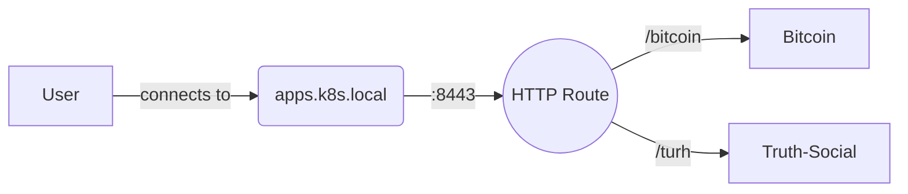

# Kubernetes Gateway API & URL Rewrite



## create openssl crt/key pair

```bash
openssl req -x509 -nodes -days 365 \
  -newkey rsa:2048 \
  -keyout tls.key \
  -out tls.crt \
  -subj "/CN=example.com/O=example.com"
```

## custom html for nginx image

```yaml
      command:
        - /bin/sh
        - -c
        - |
          envsubst < /templates/index.html.template > /usr/share/nginx/html/index.html
          nginx -g 'daemon off;'
```

```yaml
apiVersion: v1
kind: Pod
metadata:
  name: nginx-downward-api
  labels:
    app: nginx-demo
spec:
  volumes:
    - name: html
      emptyDir: {}

  initContainers:
    - name: generate-html
      image: busybox
      command:
        - sh
        - -c
        - |
          cat <<EOF > /html/index.html
          <!DOCTYPE html>
          <html>
          <head>
            <title>Pod Info</title>
          </head>
          <body>
            <h1>Kubernetes Pod Info</h1>
            <p><strong>Pod Name:</strong> $POD_NAME</p>
            <p><strong>Namespace:</strong> $POD_NAMESPACE</p>
            <p><strong>Pod IP:</strong> $POD_IP</p>
            <p><strong>Node Name:</strong> $NODE_NAME</p>
          </body>
          </html>
          EOF
      env:
        - name: POD_NAME
          valueFrom:
            fieldRef:
              fieldPath: metadata.name

        - name: POD_NAMESPACE
          valueFrom:
            fieldRef:
              fieldPath: metadata.namespace

        - name: POD_IP
          valueFrom:
            fieldRef:
              fieldPath: status.podIP

        - name: NODE_NAME
          valueFrom:
            fieldRef:
              fieldPath: spec.nodeName

      volumeMounts:
        - name: html
          mountPath: /html

  containers:
    - name: nginx
      image: nginx:latest
      ports:
        - containerPort: 80
      volumeMounts:
        - name: html
          mountPath: /usr/share/nginx/html
```

## What path does a pod or service expect?

The app itself determines this — not Kubernetes. You need to look at how it is configured to serve content.

**nginx** serves from `/` by default. Unless you add a custom `location /nginx {}` block to its config, a request to `/nginx` will return 404 because nginx has no handler for that path.

**Other apps** — look at their route definitions:
- Express: `app.get('/foo', ...)`
- Flask: `@app.route('/foo')`
- Spring: `@GetMapping("/foo")`

### Test directly with port-forward

Bypass the gateway entirely and hit the pod/service directly. This isolates whether the problem is in the gateway or the app:

```bash
kubectl port-forward svc/nginx 9090:80

curl localhost:9090/         # 200 — app serves this
curl localhost:9090/nginx    # 404 — app does NOT serve this
```

If `port-forward` returns 404, the app is the problem.  
If `port-forward` returns 200 but the gateway path returns 404, the gateway is the problem.

---

## When to use URL rewrite

**Rule:** rewrite when the public path (what the client sends) is different from the internal path (what the backend app actually handles).

| Public path (client) | Backend serves at | Rewrite needed? |
|---|---|---|
| `/nginx` | `/` | Yes — strip the prefix |
| `/` | `/` | No |
| `/api/v1` | `/api/v1` | No — paths match |
| `/nginx/health` | `/health` | Yes — strip `/nginx` prefix |
| `/nginx` | has `location /nginx {}` in nginx.conf | No — app handles it natively |

**The core idea:** when you add a path prefix in the gateway only for *routing* purposes (to send different paths to different backends), the backend app knows nothing about that prefix. You must rewrite it away before the request reaches the app.

---

## How to add a URL rewrite in HTTPRoute

```yaml
rules:
- matches:
  - path:
      type: PathPrefix
      value: /nginx
  filters:
  - type: URLRewrite
    urlRewrite:
      path:
        type: ReplacePrefixMatch
        replacePrefixMatch: /    # /nginx → /,  /nginx/foo → /foo
  backendRefs:
  - name: nginx
    port: 80
```

`ReplacePrefixMatch: /` strips the matched prefix and replaces it with `/`.

---

## Troubleshooting scenarios

### Scenario 1: 404 at gateway path, works via port-forward

**Symptom:**
```
curl localhost:8080/nginx    → 404
kubectl port-forward svc/nginx 9090:80
curl localhost:9090/         → 200
curl localhost:9090/nginx    → 404
```

**What it means:** The gateway is forwarding the path `/nginx` unchanged to the backend. The backend only serves `/`.

**Fix:** Add a `URLRewrite` filter to replace `/nginx` with `/`.

---

### Scenario 2: Multiple services on one gateway, one returns 404

You have two services — `nginx` at `/nginx` and `api` at `/api` — both behind the same gateway.

```yaml
# Route 1
- matches:
  - path:
      type: PathPrefix
      value: /nginx
  backendRefs:
  - name: nginx
    port: 80

# Route 2
- matches:
  - path:
      type: PathPrefix
      value: /api
  backendRefs:
  - name: api-server
    port: 3000
```

Both will 404 because neither app knows about the `/nginx` or `/api` prefix — those prefixes only exist in your gateway routing rules.

**Fix:** Add a rewrite filter to each rule:
```yaml
filters:
- type: URLRewrite
  urlRewrite:
    path:
      type: ReplacePrefixMatch
      replacePrefixMatch: /
```

---

### Scenario 3: Works at `/`, 404 at `/nginx/about`

**Symptom:**
```
curl localhost:8080/nginx          → 200
curl localhost:8080/nginx/about    → 404
```

**What it means:** The rewrite is working — `/nginx` → `/` serves the homepage. But `/nginx/about` is being rewritten to `/about`, and the backend doesn't have that route.

This is a backend issue, not a gateway issue. The app simply doesn't have a `/about` page.

**Verify:**
```bash
kubectl port-forward svc/nginx 9090:80
curl localhost:9090/about    # also 404 — confirms it's the app, not the gateway
```

---

### Scenario 4: Rewrite configured but still 404

**Symptom:** You added the rewrite filter, applied it, but still get 404.

**Things to check:**

1. Did the route actually update?
   ```bash
   kubectl get httproute nginx-route -o yaml
   ```
   Confirm the `filters` block is present in the output.

2. Is the HTTPRoute accepted by the gateway?
   ```bash
   kubectl get httproute nginx-route
   # Look for: ACCEPTED = True, PROGRAMMED = True
   ```

3. Is the gateway pod itself running?
   ```bash
   kubectl get pods -n nginx-gateway   # or whichever namespace your gateway controller is in
   ```

4. Is the path match correct? `PathPrefix` is case-sensitive — `/Nginx` and `/nginx` are different.

---

### Scenario 5: App needs to know the original path (no rewrite)

Sometimes you don't want to rewrite — for example, your app has a `/nginx` route defined internally and handles it correctly.

**Verify:**
```bash
kubectl port-forward svc/myapp 9090:8080
curl localhost:9090/nginx    # 200 — app handles /nginx natively
```

If this returns 200, do not add a rewrite. The gateway can route `/nginx` to the backend and the backend will handle it. Adding an unnecessary rewrite would break it.

---

## Quick diagnostic flowchart

```
GET localhost:8080/nginx → 404
         |
         v
kubectl port-forward svc/nginx 9090:80
curl localhost:9090/nginx
         |
    _____|_____
   |           |
  404          200
   |           |
App doesn't   App handles /nginx natively.
serve /nginx.  Problem is in the gateway —
Add rewrite.   check route match, gateway
               status, or controller logs.
         |
         v
curl localhost:9090/
         |
    _____|_____
   |           |
  200          404
   |           |
Add rewrite   App is broken.
to strip      Check app logs:
/nginx → /    kubectl logs deploy/nginx
```

---

## Files in this project

| File | Purpose |
|---|---|
| `kind-config.yaml` | Kind cluster — maps containerPort 31437 → hostPort 8080 |
| `custom-nginx.yaml` | ConfigMap (custom HTML) + Deployment + Service for nginx |
| `gateway.yaml` | Gateway resource using nginx gateway class, listens on port 80 |
| `nroutes.yaml` | HTTPRoute — routes `/nginx` to the nginx service with path rewrite |
